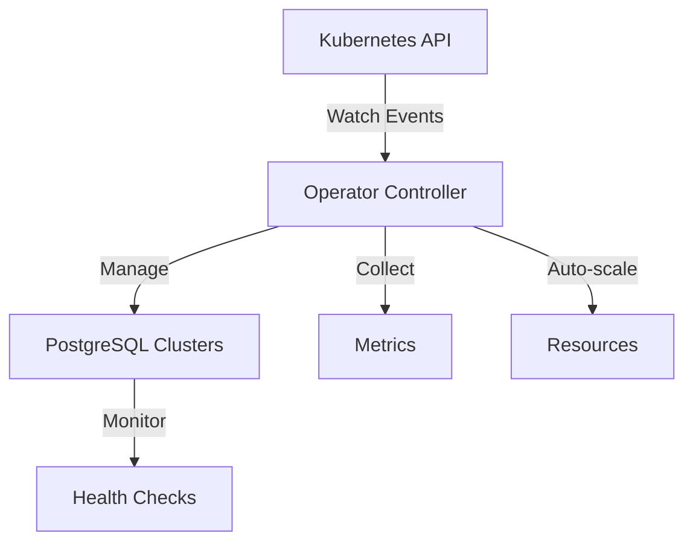

# 🐘 PostgreSQL Auto-Scaling Operator

<div align="center">
  
  <br>
  <strong>A Kubernetes Operator for Automated PostgreSQL Management</strong>
  <br><br>
</div>

[](LICENSE)
[](https://www.python.org/)
[](https://kubernetes.io/)

## 📋 Project Status

🚧 **Current Status:** Development

## 🎯 Features

- ✨ Automated PostgreSQL cluster deployment
- 📈 Dynamic scaling based on resource utilization
- 🔄 Automated failover and recovery
- 📊 Prometheus metrics integration
- 🔒 Secure credential management
- 💾 Automated backup and restore

## 🚀 Prerequisites

- Kubernetes cluster (v1.19+)
- `kubectl` CLI tool
- Helm (v3.0+)
- PostgreSQL knowledge
- Python 3.9+

## ⚙️ Installation

1. **Clone the repository**
```bash
git clone https://github.com/yourusername/postgres-operator.git
cd postgres-operator
```

2. **Install Custom Resource Definitions**
```bash
kubectl apply -f deploy/crd.yaml
```

3. **Configure RBAC**
```bash
kubectl apply -f deploy/rbac.yaml
```

4. **Deploy the operator**
```bash
kubectl apply -f deploy/operator.yaml
```

## 📝 Configuration

Create a PostgreSQL cluster by applying a custom resource:

```yaml
apiVersion: database.example.com/v1
kind: PostgresCluster
metadata:
  name: my-postgres
spec:
  replicas: 3
  version: "14.5"
  resources:
    requests:
      memory: "1Gi"
      cpu: "500m"
  storage:
    size: "10Gi"
```

## 🔍 Monitoring

The operator exposes metrics at `:8080/metrics` in Prometheus format:
- Connection pool statistics
- Query performance metrics
- Resource utilization
- Replication lag

## 🛠️ Development Setup

```bash
# Create virtual environment
python -m venv venv
source venv/bin/activate

# Install dependencies
pip install -r requirements.txt

# Run tests
python -m pytest tests/
```

## 🔧 Architecture



## 📞 Support

- 📧 [Email Support](mailto:naeem.ali@devopshound.com)
