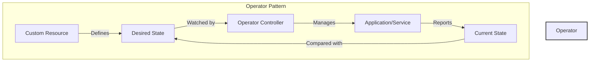

# 🎯 Kubernetes Operators Collection

<div align="center">
  
  <br>
  <strong>Extending Kubernetes with Custom Controllers</strong>
  <br><br>

  [](https://kubernetes.io)
  [](https://kubernetes.io/docs/concepts/extend-kubernetes/operator/)
  [](LICENSE)
</div>

## 🤔 What are Kubernetes Operators?

Operators are software extensions to Kubernetes that make use of [custom resources](https://kubernetes.io/docs/concepts/extend-kubernetes/api-extension/custom-resources/) to manage applications and their components. Operators follow Kubernetes principles, particularly the [control loop](https://kubernetes.io/docs/concepts/architecture/controller/).

### How They Work



## 📦 Available Operators

### 1️⃣ Database Operators

<table>
  <tr>
    <td align="center">
      <br>
      <a href="database operators/postgres-operator">PostgreSQL</a>
      <br>Auto-scaling & HA
    </td>
    <td align="center">
      <br>
      <a href="database operators/Redis Failover Operator">Redis</a>
      <br>Failover & Backup
    </td>
    <td align="center">
      <br>
      <a href="database operators/database backup">DB Backup</a>
      <br>Multi-DB Backup
    </td>
  </tr>
</table>

### 2️⃣ CI/CD & GitOps

<table>
  <tr>
    <td align="center">
      <br>
      <a href="ci_cd & gitops operator">GitOps</a>
      <br>Automation & Sync
    </td>
  </tr>
</table>

## 🎯 Key Benefits

- 📈 **Automated Operations**: Reduce manual intervention
- 🔄 **Self-Healing**: Automatic recovery from failures
- 📊 **Consistent Management**: Standardized operations
- 🔍 **Domain Knowledge**: Embedded operational expertise

## 🛠️ Technical Components

### Custom Resource Definitions (CRDs)
```yaml
apiVersion: apiextensions.k8s.io/v1
kind: CustomResourceDefinition
metadata:
  name: example.operator.domain
spec:
  group: operator.domain
  names:
    kind: Example
    plural: examples
  scope: Namespaced
  versions:
    - name: v1
      served: true
      storage: true
```

### Controller Pattern
- 👀 Watches for resource changes
- 🔄 Reconciles current state with desired state
- 🎯 Implements domain-specific logic
- 📊 Reports status and metrics

## 📚 Learning Resources

- 📖 [Kubernetes Operators Explained](https://kubernetes.io/docs/concepts/extend-kubernetes/operator/)
- 🎓 [Operator Pattern](https://kubernetes.io/docs/concepts/extend-kubernetes/operator/)
- 🔧 [Operator SDK](https://sdk.operatorframework.io/)
- 📑 [Custom Resources](https://kubernetes.io/docs/concepts/extend-kubernetes/api-extension/custom-resources/)

## 🚀 Getting Started

1. **Prerequisites**
   - Kubernetes cluster (v1.24+)
   - kubectl configured
   - Understanding of CRDs

2. **Installation**
   ```bash
   # Clone the repository
   git clone https://github.com/yourusername/kubernetes-operators.git
   
   # Navigate to specific operator
   cd kubernetes-operators/<operator-name>
   
   # Follow operator-specific instructions
   ```


## 📞 Support

- 📧 [Email Support](mailto:naeem.ali@devopshound.com)

---
<div align="center">
  <sub>Built with ❤️ by the Kubernetes Community</sub>
  <br>
  <sub>"Automating the things that should be automated!"</sub>
</div>
