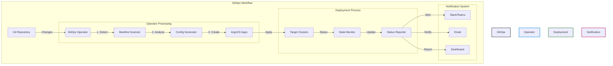

# 🔄 GitOps & CI/CD Automation Operator

<div align="center">
  <table>
    <tr align="center">
      <td width="200">
        
        <br>ArgoCD
      </td>
      <td width="200">
        
        <br>Kubernetes
      </td>
      <td width="200">
        
        <br>GitOps
      </td>
    </tr>
  </table>

  <strong>🚀 Automate Your GitOps Workflow with Intelligence</strong>
  <br><br>

  [](https://kubernetes.io)
  [](https://argoproj.github.io/cd)
  [](https://helm.sh)
</div>

## 🎯 Core Features

### 🔄 Dynamic Application Management
- 📦 Auto-discovery of Kubernetes manifests
- 🛠️ Multi-format support (Helm, Kustomize, YAML)
- 🚀 Automated ArgoCD application creation

### 🌍 Environment Management
- 🎯 Dev/Stage/Prod environment overlays
- ⚙️ Cluster-specific configurations
- 🏗️ Dynamic namespace provisioning

### ⚡ CI/CD Integration
- 🔄 PR-driven environment promotion
- 🔍 Automated change detection
- 🛠️ Configuration drift prevention

## 🏗️ Architecture



## 🚀 Quick Start

### Prerequisites
- 🎯 Kubernetes 1.22+
- 🔄 ArgoCD 2.4+
- 🛠️ kubectl 1.24+
- ⚙️ Helm 3.8+

### 1️⃣ Installation

```bash
# Add Helm repository
helm repo add gitops-operator https://yourorg.github.io/helm-charts

# Install the operator
helm install gitops-operator gitops-operator/gitops-operator \
  --namespace gitops-system \
  --create-namespace \
  --set argocd.enabled=true
```

### 2️⃣ Configuration Example

```yaml
apiVersion: gitops.example.com/v1alpha1
kind: GitRepoScan
metadata:
  name: monorepo-scan
spec:
  repoUrl: https://github.com/yourorg/monorepo.git
  targetRevision: main
  scanInterval: 5m
  pathMappings:
    - sourcePath: "/apps/frontend/overlays/prod"
      destinationCluster: "in-cluster"
      destinationNamespace: "frontend-prod"
```

## 📊 Advanced Features

### 🔍 Cluster Discovery
```yaml
spec:
  clusterDiscovery:
    enabled: true
    labelSelector: "environment=dev"
```

### 🔄 Sync Policies
```yaml
spec:
  syncPolicy:
    automated:
      prune: true
      selfHeal: true
    syncOptions:
      - CreateNamespace=true
```

### 📧 Notifications
```yaml
spec:
  notifications:
    slack:
      webhookUrlSecret: slack-webhook
    email:
      recipients: "devops@example.com"
```

## 🛠️ Development

```bash
# Build locally
make docker-build IMG=ghcr.io/yourorg/gitops-operator:dev

# Deploy to test cluster
make deploy IMG=ghcr.io/yourorg/gitops-operator:dev

# Run tests
make test
```

## 🔧 Troubleshooting

| Issue | Solution | Status |
|-------|----------|---------|
| Apps Not Created | Check GitRepoScan logs | 🔴 |
| Sync Failed | Verify ArgoCD connection | 🟡 |
| Auth Error | Check credentials | 🟠 |

## 💡 Pro Tips

> 💭 "GitOps: Where 'git push' meets 'kubectl apply' in perfect harmony!"

---
<div align="center">
  <sub>Built with 💖 by DevOps Engineers who believe in the power of automation</sub>
  <br>
  <sub>"In Git we trust, but we verify with GitOps!"</sub>
</div>
