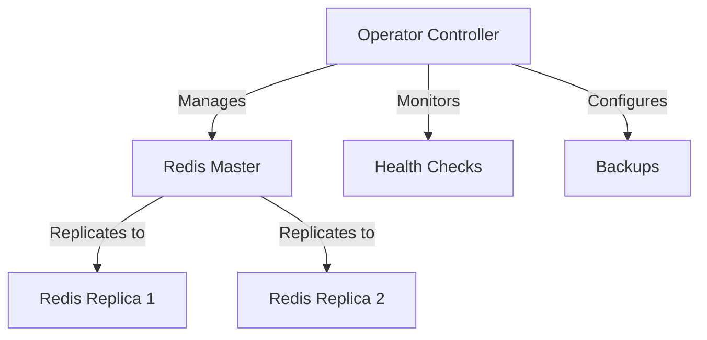
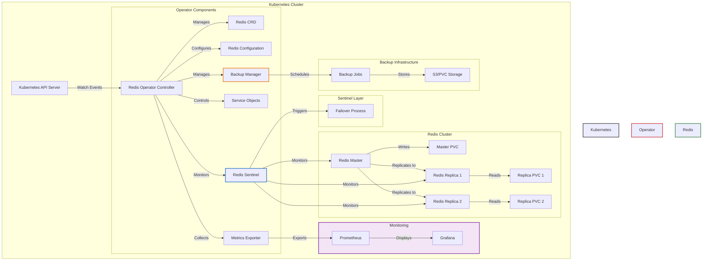

# 🔄 Redis Failover Operator

<div align="center">
  
  <br>
  <strong>Automated Redis Cluster Management for Kubernetes</strong>
  <br><br>
</div>

[](LICENSE)
[](https://golang.org/)
[](https://kubernetes.io/)
[](https://redis.io/)


# Redis Failover Operator Project Structure

```
redis-operator/
├── deploy/                   # Kubernetes deployment files
│   ├── crd.yaml             # Custom Resource Definition
│   ├── operator.yaml        # Operator deployment
│   └── rbac.yaml            # RBAC permissions
├── redisoperator/           # Python package
│   ├── __init__.py         
│   ├── operator.py          # Main operator logic
│   ├── failover.py         # Failover management
│   ├── backup.py           # Backup operations
│   ├── config.py           # Configuration handling
│   └── sentinel.py         # Sentinel integration
├── tests/                   # Unit tests
│   ├── test_failover.py
│   └── test_backup.py
├── Dockerfile              # Operator image build
├── requirements.txt        # Python dependencies
└── README.md              # Project documentation
```

## Component Descriptions

### Core Components
- `operator.py`: Main controller logic for Redis cluster management
- `failover.py`: Handles automatic failover using Redis Sentinel
- `backup.py`: Manages backup and restore operations
- `config.py`: Configuration management and validation
- `sentinel.py`: Redis Sentinel integration and monitoring

### Deployment Files
- `crd.yaml`: Defines RedisCluster custom resource
- `operator.yaml`: Operator deployment configuration
- `rbac.yaml`: Required RBAC permissions for operator

### Testing
- `test_failover.py`: Unit tests for failover logic
- `test_backup.py`: Unit tests for backup operations

### Build & Dependencies
- `Dockerfile`: Multi-stage build for operator image
- `requirements.txt`: Python package dependencies


## 🎯 Features

- ⚡ **High Availability**
  - Automatic failover on master node failure
  - Seamless replica promotion
  - Zero-downtime configuration updates

- 💾 **Backup & Recovery**
  - Scheduled backups to S3 or PVC
  - Point-in-time recovery
  - Configurable retention policies

- 📊 **Monitoring**
  - Redis cluster health monitoring
  - Prometheus metrics integration
  - Custom alerting rules

- 🔒 **Security**
  - TLS encryption support
  - Password authentication
  - Role-based access control

## 🚀 Quick Start

### Prerequisites

- Kubernetes cluster (v1.19+)
- Helm v3
- kubectl CLI
- Access to container registry

### Installation

1. **Deploy the operator:**
```bash
# Install CRDs
kubectl apply -f deploy/crds/

# Deploy operator
kubectl apply -f deploy/operator.yaml
```

2. **Create a Redis cluster:**
```yaml
apiVersion: redis.example.com/v1
kind: RedisCluster
metadata:
  name: my-redis
spec:
  replicas: 3
  version: "6.2"
  persistence:
    enabled: true
    size: 10Gi
```

## 🏗️ Architecture



### Detailed Architecture


## 📊 Monitoring

Access Redis metrics at `:9121/metrics`:
- Command execution stats
- Memory usage
- Connection stats
- Replication status

## ⚙️ Configuration Options

| Parameter | Description | Default |
|-----------|-------------|---------|
| `replicas` | Number of Redis replicas | 2 |
| `persistence.enabled` | Enable persistent storage | true |
| `resources.requests.memory` | Memory request | 1Gi |
| `monitoring.enabled` | Enable Prometheus metrics | true |

## 🛠️ Development

```bash
# Build operator
make build

# Run tests
make test

# Generate manifests
make manifests
```

## 🚨 Troubleshooting

Common issues and solutions:
- 🔍 Failover not working
- 🔌 Connection issues
- 💽 Persistence problems


## 💬 Support

- 📧 [Email Support](mailto:naeem.ali@devopshound.com)
---
<div align="center">
  <sub>Built with ❤️ for the Kubernetes community</sub>
</div>


