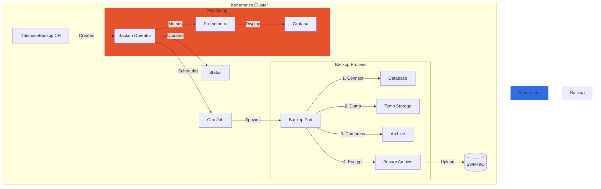

# 💾 Database Backup/Restore Operator

<div align="center">
  
  <br>
  <strong>Because losing data is scarier than Monday mornings!</strong>
  <br><br>
</div>


## 🎯 Supported Databases

<div align="center">
  
  
  
</div>

## 🌟 Features

- 🗄️ **Multi-Database Support**
  - PostgreSQL (`pg_dump`/`pg_restore`)
  - MySQL (`mysqldump`)
  - MongoDB (`mongodump`/`mongorestore`)
  
- 📦 **Storage Options**
  - AWS S3 
  - MinIO 
  - Any S3-compatible storage

- 🔄 **Backup Features**
  - 📅 Scheduled backups (cron syntax)
  - 🗑️ Smart retention policies
  - 📊 Real-time status tracking
  - 🔐 End-to-end encryption

## 🏗️ Architecture



## 🚀 Quick Start

### Prerequisites
- Kubernetes 1.20+ (because old clusters are like old backups - unreliable! 😉)
- `kubectl` configured
- S3/MinIO credentials (your data's VIP pass to the cloud)

### 1️⃣ Installation

```bash
# Deploy the operator (it's like hiring a very reliable robot)
kubectl apply -f deploy/crd.yaml
kubectl apply -f deploy/rbac.yaml
kubectl apply -f deploy/operator.yaml
```

### 2️⃣ Configuration

```yaml
apiVersion: backup.database.example.com/v1
kind: DatabaseBackup
metadata:
  name: prod-db-backup
spec:
  schedule: "0 2 * * *"  # 2 AM daily (when the bugs are sleeping 🐛)
  database:
    type: postgresql
    name: my-precious-data
  retention:
    days: 30
    copies: 5
```

## 📊 Monitoring Dashboard

<div align="center">
  
</div>

## 🔧 Troubleshooting

| Issue | Solution | Panic Level |
|-------|----------|-------------|
| Backup Failed | Check credentials | 😰 |
| Storage Full | Clean old backups | 😱 |
| Slow Backup | Optimize DB | 🥱 |

## 🎯 Development

```bash
# Build it yourself (like LEGO, but for data)
make docker-build IMG=db-backup-operator:dev

# Deploy your creation
make deploy IMG=db-backup-operator:dev

# Test it (because YOLO is not a backup strategy)
make test
```

## 🧪 Testing Your Backups

Because "untested backup" is like "undefined behavior" - scary and unpredictable!

## 💭 Dad Jokes Corner

> Why did the database admin leave his wife?
> 
> He had too many commitment issues and couldn't guarantee atomicity! 

> What's a DBA's favorite band?
>
> The Backup Plan!

---
<div align="center">
  <sub>Built with 💾 by people who learned about backups the hard way</sub>
  <br>
  <sub>Remember: "To err is human, to backup divine!"</sub>
</div>
