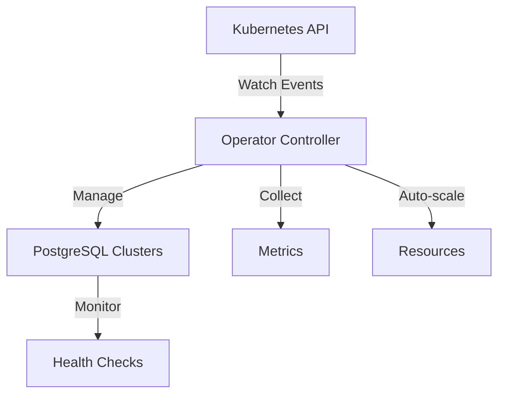

# 🐘 PostgreSQL Auto-Scaling Operator

<div align="center">
  
  <br>
  <strong>A Kubernetes Operator for Automated PostgreSQL Management</strong>
  <br><br>
</div>

[](LICENSE)
[](https://www.python.org/)
[](https://kubernetes.io/)


## 🔧 Architecture



## 📁 Project Structure

```
postgres-operator/
├── deploy/                      # Deployment configurations
│   ├── crd.yaml                 # Custom Resource Definition
│   ├── operator.yaml            # Operator deployment
│   └── rbac.yaml               # RBAC permissions
│
├── postgresoperator/           # Core operator package
│   ├── __init__.py
│   ├── operator.py             # Main controller logic
│   ├── metrics.py              # Metrics collection
│   ├── scaling.py              # Auto-scaling algorithms
│   └── config.py              # Configuration handling
│
├── tests/                      # Test suite
│   └── test_operator.py       # Operator unit tests
│
├── Dockerfile                  # Container image definition
├── requirements.txt           # Python dependencies
└── README.md                  # Documentation
```             


## 🎯 Features

- ✨ Automated PostgreSQL cluster deployment
- 📈 Dynamic scaling based on resource utilization
- 🔄 Automated failover and recovery
- 📊 Prometheus metrics integration
- 🔒 Secure credential management
- 💾 Automated backup and restore

## 🚀 Prerequisites

- Kubernetes cluster (v1.19+)
- `kubectl` CLI tool
- Helm (v3.0+)
- PostgreSQL knowledge
- Python 3.9+

## ⚙️ Installation

1. **Clone the repository**
```bash
git clone https://github.com/yourusername/postgres-operator.git
cd postgres-operator
```

2. **Install Custom Resource Definitions**
```bash
kubectl apply -f deploy/crd.yaml
```

3. **Configure RBAC**
```bash
kubectl apply -f deploy/rbac.yaml
```

4. **Deploy the operator**
```bash
kubectl apply -f deploy/operator.yaml
```

## 📝 Configuration

Create a PostgreSQL cluster by applying a custom resource:

```yaml
apiVersion: database.example.com/v1
kind: PostgresCluster
metadata:
  name: my-postgres
spec:
  replicas: 3
  version: "14.5"
  resources:
    requests:
      memory: "1Gi"
      cpu: "500m"
  storage:
    size: "10Gi"
```

## 🔍 Monitoring

The operator exposes metrics at `:8080/metrics` in Prometheus format:
- Connection pool statistics
- Query performance metrics
- Resource utilization
- Replication lag

## 🛠️ Development Setup

```bash
# Create virtual environment
python -m venv venv
source venv/bin/activate

# Install dependencies
pip install -r requirements.txt

# Run tests
python -m pytest tests/
```

## 🛠️ Implementation Notes

### Technology Stack
- 🔄 Built using [Kopf](https://github.com/nolar/kopf) framework for Kubernetes operator development in Python
- 📊 Prometheus integration for metrics collection and monitoring
- 🐘 PostgreSQL native metrics collection (planned)

### Scaling Logic
The operator implements intelligent scaling based on multiple factors:

- 📈 **Performance Metrics**
  - Queries per second (QPS) per replica
  - Average query latency
  - CPU and memory utilization

- ⏲️ **Scaling Controls**
  - Configurable cooldown periods between scaling operations
  - Gradual scaling to prevent resource spikes
  - Maximum and minimum replica constraints

### Monitoring Integration
- 📡 Prometheus metrics push gateway integration
- 🔍 Real-time performance monitoring
- 📊 Custom metrics collection pipeline

### Security & Permissions
- 🔒 RBAC permissions configured for minimal required access
- 🛡️ Namespace-scoped resource management
- 🔐 Secure communication channels between components

### Current Limitations
> ⚠️ Note: Metrics collection currently uses simulated data. Integration with actual PostgreSQL metrics collection is in progress.

## ⚠️ Missing Components

1. **Backup Management**
   - Implement periodic backup scheduling
   - Add backup retention policies
   - Create backup verification system

2. **Disaster Recovery**
   - Add point-in-time recovery
   - Implement cross-region replication
   - Create disaster recovery documentation

3. **Security Features**
   - Add SSL/TLS configuration
   - Implement network policies
   - Add pod security policies

4. **Advanced Monitoring**
   - Add alerting rules
   - Create custom dashboards
   - Implement log aggregation


## 📞 Support

- 📧 [Email Support](mailto:naeem.ali@devopshound.com)
