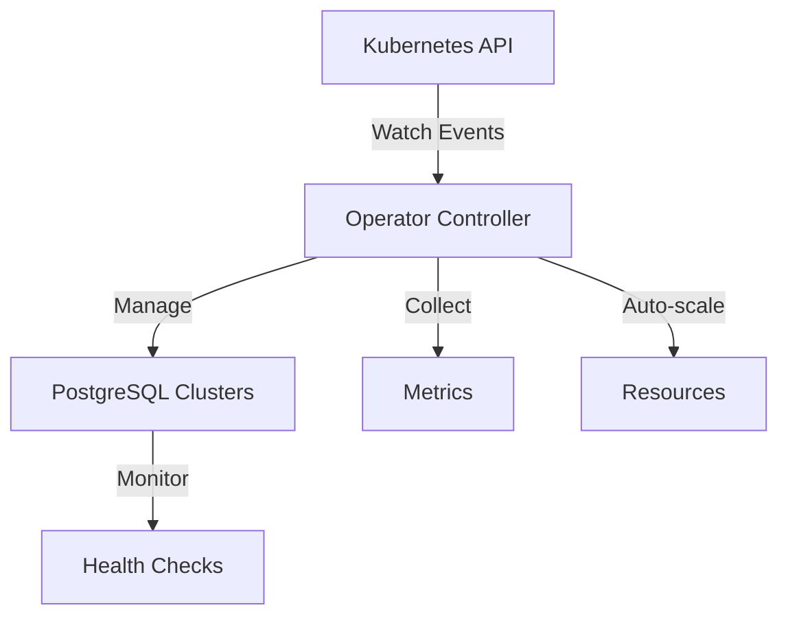
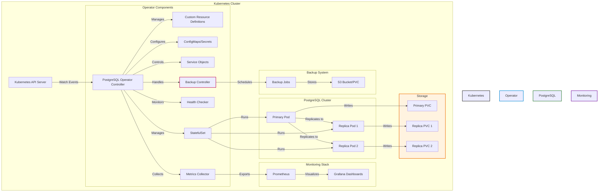

## 🔧 Architecture

```mermaid
graph TD
    A[Kubernetes API] -->|Watch Events| B[Operator Controller]
    B -->|Manage| C[PostgreSQL Clusters]
    B -->|Collect| D[Metrics]
    B -->|Auto-scale| E[Resources]
    C -->|Monitor| F[Health Checks]
```

### Detailed Architecture

```mermaid
graph TD
    subgraph Kubernetes Cluster
        API[Kubernetes API Server] -->|Watch Events| Controller[PostgreSQL Operator Controller]
        
        subgraph Operator Components
            Controller -->|Manages| CRD[Custom Resource Definitions]
            Controller -->|Configures| Config[ConfigMaps/Secrets]
            Controller -->|Controls| Services[Service Objects]
            Controller -->|Manages| StatefulSet[StatefulSet]
            Controller -->|Monitors| Health[Health Checker]
            Controller -->|Collects| Metrics[Metrics Collector]
            Controller -->|Handles| Backup[Backup Controller]
        end
        
        subgraph PostgreSQL Cluster
            StatefulSet -->|Runs| Primary[Primary Pod]
            StatefulSet -->|Runs| Replica1[Replica Pod 1]
            StatefulSet -->|Runs| Replica2[Replica Pod 2]
            Primary -->|Replicates to| Replica1
            Primary -->|Replicates to| Replica2
        end
        
        subgraph Storage
            Primary -->|Writes| PVC1[Primary PVC]
            Replica1 -->|Writes| PVC2[Replica PVC 1]
            Replica2 -->|Writes| PVC3[Replica PVC 2]
        end
        
        subgraph Monitoring Stack
            Metrics -->|Exports| Prometheus[Prometheus]
            Prometheus -->|Visualizes| Grafana[Grafana Dashboards]
        end
        
        subgraph Backup System
            Backup -->|Schedules| BackupJob[Backup Jobs]
            BackupJob -->|Stores| S3[S3 Bucket/PVC]
        end
    end

    style Kubernetes Cluster fill:#f5f5f5,stroke:#333,stroke-width:2px
    style Operator Components fill:#e1f5fe,stroke:#0288d1,stroke-width:2px
    style PostgreSQL Cluster fill:#e8f5e9,stroke:#2e7d32,stroke-width:2px
    style Storage fill:#fff3e0,stroke:#ef6c00,stroke-width:2px
    style Monitoring Stack fill:#f3e5f5,stroke:#7b1fa2,stroke-width:2px
    style Backup System fill:#fce4ec,stroke:#c2185b,stroke-width:2px
```

## 🛠️ Implementation Notes
